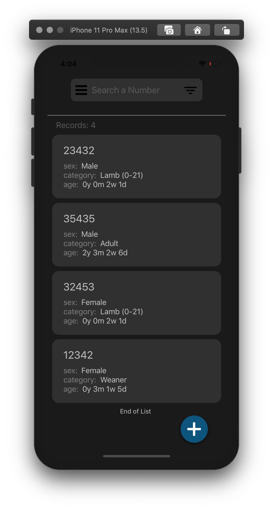
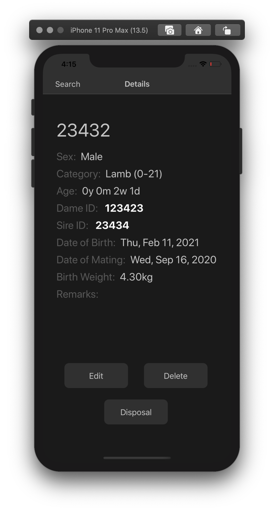

# BhedduApp

A react native app to add and manage inventory of sheep with different statistics automatically calculated

The App is written using expo and react native.
App is divided into differnt screens that allow for different activities

## Main Screen

It shows the list of your inventory of lambs and categorises them according to their age.

## Details Screen

Each entry would have its own details screen

## Statistics Screen

Statistics screen would show related statistics between the given dates

